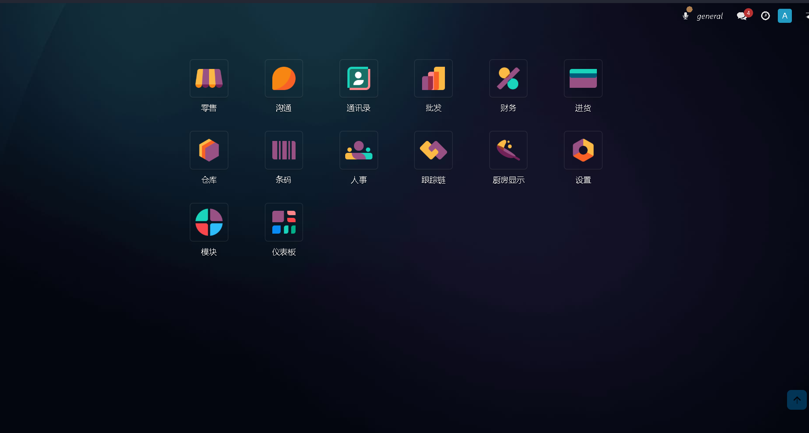

# 欢迎来到 POS IN STORE

本文档及演示界面基于odoo 17.0 社区版，其中包含 pos_in_store 整套套件
由于国情的原因，其中某些功能只在大陆地区运行良好

### 模块列表

* `fc_ai_service` - 主要用于单据OCR自动化功能.
* `fc_contract` - 定期合同管理模块.
* `fc_create_order_from_pos` - 在POS前台将POS订单进行转化的功能，主要转化为`进货单`及`销售订单`,以及快速打印商品价格标签.
* `fc_printer_service` - 基本打印服务，可用于ODOO系统直接打印单据.
* `fc_printer_service_pos` - 用于POS小票的打印、计价称读取以及副屏（客显）显示等功能.
* `fc_purchase_return` - 采购退货，直接在采购订单中进行退货操作
* `pos_in_store` - 主模块，深度定制的POS门店管理功能，符合中国人操作习惯的零售管理系统
* `pos_pay_zh` - 针对中国大陆流行的支付方式的集成 (用在前台pos)

### 本地支持模块 
  * `odoo_services` -收银机硬件相关设备支持 （windows 64位系统）
  这是一个windows exe 程序，并不是odoo模块，以上某些odoo模块依赖本程序

### 推荐的第三方模块
* `app_base_chinese` - 用于中文本地化习惯
* `app_odoo_customize` - 用于定制odoo一些系统中的设置
* `auto_database_backup` - 如其名，用于自动化备份数据的模块
* `wecom_theme` - 后端主题，提供类似企业版的主界面以及暗黑主题
* `custom_list_view` - 在tree中添加序号的功能
  
